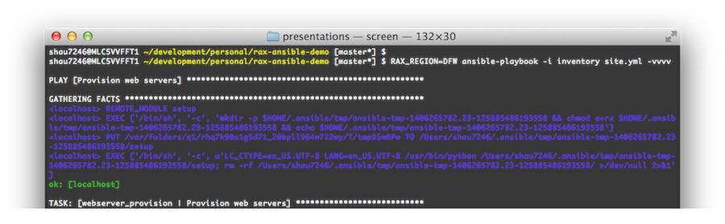

= id="title"

## Ansible at Rackspace
### *Shaunak Kashyap, Developer Advocate*

---
= data-y="2000" id="intro"

## Let's talk about...

- Lessons learnt from developer.rackspace.com deployment, *and*
- Using Ansible `rax*` modules 
- Helpful references

---
= data-y="4000" id="lesson-vault-is-great"

## Lessons Learnt:

## *Ansible Vault == *

---
= data-y="4000" id="lesson-vault-sucks-for-collaboration"

## Lessons Learnt:

## *Ansible Vault ==  for collab*

---
= data-y="4000" id="lesson-reuse"

## Lessons Learnt:

## *Reuse Ansible Roles*

---
= data-y="4000" id="lesson-contribute-back"

## Lessons Learnt:

## *Contribute back to Ansible*

---
= data-y="6000" id="live-demo"

## Live Demo

- Will spin up simple load-balanced web site with 2 webservers
- Each web server will run nginx + php
- Will demonstrate use of `rax` and `rax_clb` Ansible modules

---
= data-y="8000" id="on-the-shoulders-of-giants"

## On the shoulders of giants

- Jesse Keating

    *https://twitter.com/iamjkeating*

    *https://github.com/j2sol*

- Matt Martz

    *https://twitter.com/sivel*

    *https://github.com/sivel*

- Ansible Google Group

    *https://groups.google.com/forum/#!forum/ansible-project*

---
= data-y="10000" id="fin"

## Get to know us
 
- Rackspace Developer web site

    *https://developer.rackspace.com/*

    *https://github.com/rackerlabs/developer.rackspace.com/*

- Today's live demo

    *https://github.com/ycombinator/rax-ansible-demo*

- Me

    *https://twitter.com/shaunak*

    *https://github.com/ycombinator*

